<p align="center" width="100%">
    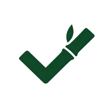
</p>
<h1 align="center" width="100%"> 知行 ActHub </h1>

## 项目简介

本项目是上海交通大学 NIS3366《项目管理与软件设计》课程设计，我们小组六人在两周内进行项目设计与开发，完成了这款鸿蒙系统日程管理与效率应用 **知行 ActHub**。应用围绕「**计划 Plan、待办 Todo、专注 Focus、闪记 Idea、我的 User**」构建统一工作流，让任务与想法在同一空间内自由流转。

## 项目亮点

- **设计哲学**：日程管理、待办事项、想法记录与 AI 洞察形成闭环，支持“自由流转”的个人生产力路径，满足多样化的时间管理与创意捕捉需求。
- **交互逻辑**：可交互卡片绑定点击、左右滑动触发行为、删除与撤销（Undo）反馈、Overlay 弹层导航、沉浸式专注计时等多样交互，提升使用效率与体验。
    <div style="text-align: center;">
        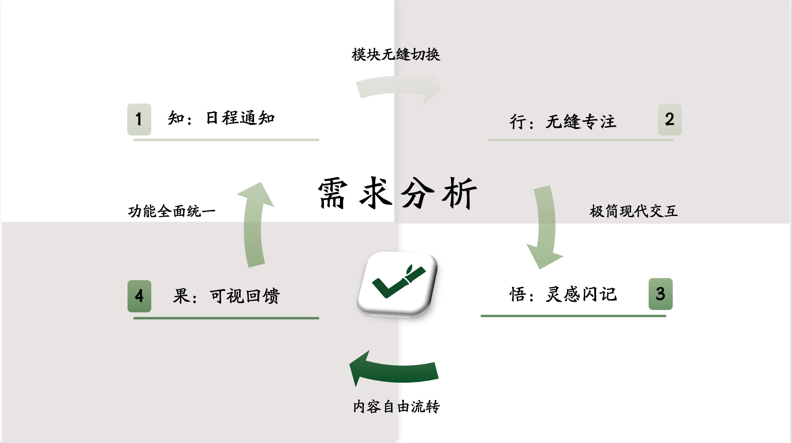
        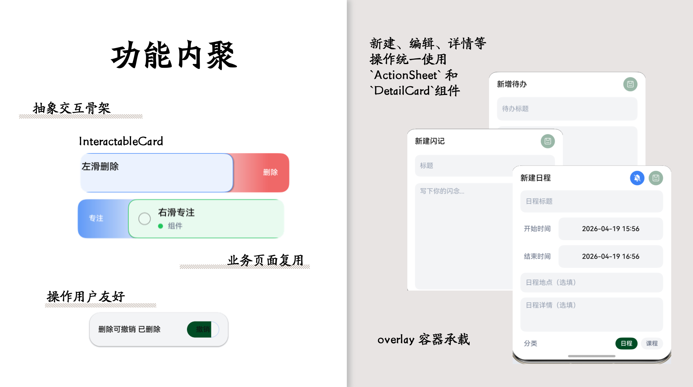
    </div>
- **页面体系**：日程、待办、专注、闪记、我的五大场景以及搜索、AI 洞察、详情卡片和表单等二级页面，支持深浅色主题切换，覆盖从登录到主工作台的完整路径。
- **数据设计**：基于用户维度分库的 ORM + Repository 模式，提供清晰的数据访问层次与用户数据隔离，支持本地优先的信息安全策略。
    <div style="text-align: center;">
        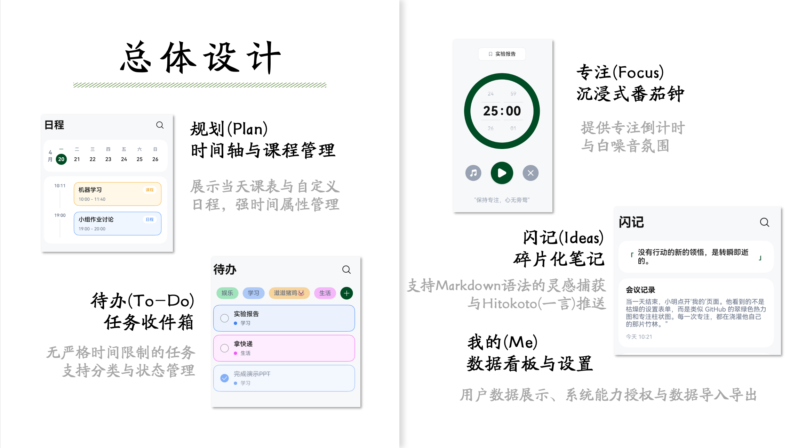
        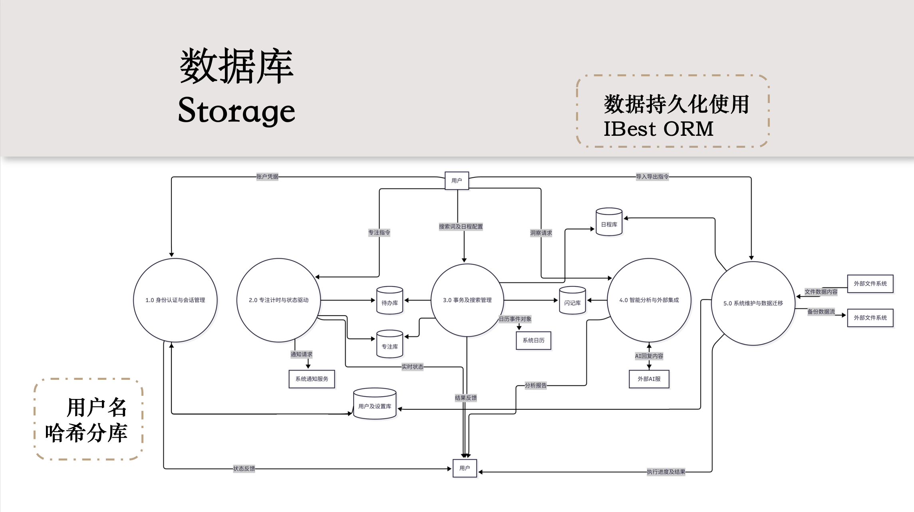
    </div>
- **系统能力**：集成 Notification（通知）、Calendar（日历）、LiveView（实况窗）、CryptoArchitectureKit（加密架构套件）等系统能力，提升应用功能丰富度与平台适配性。
- **智能能力**：提供 AI 洞察入口，支持全量分析与选中笔记对话（除 AI 请求外，业务数据本地优先存储），为后续智能功能扩展打下基础。
    <div style="text-align: center;">
        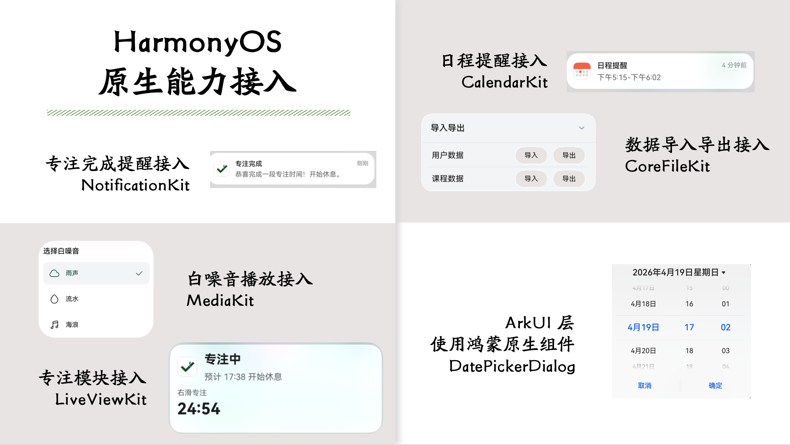
        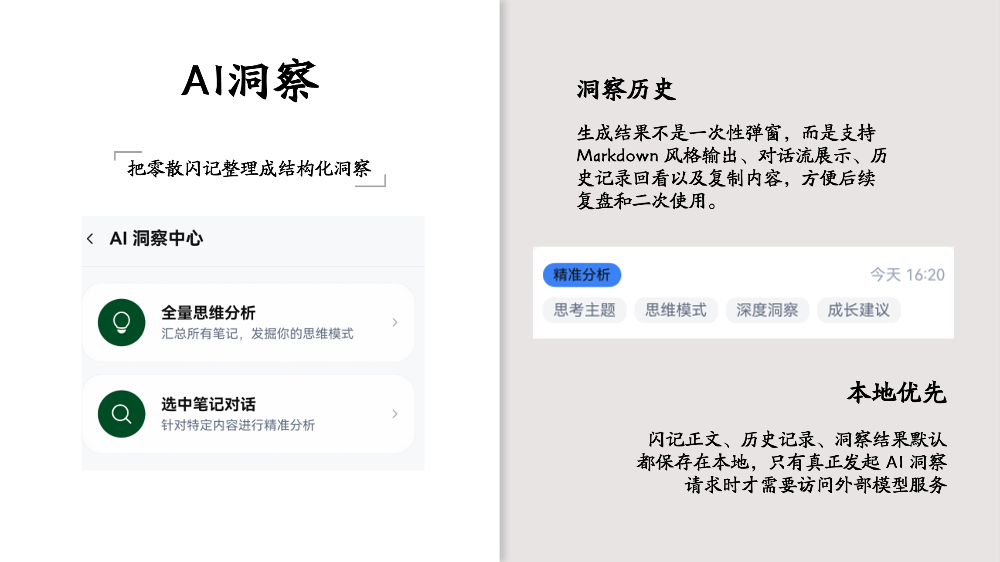
    </div>

## 项目结构
```text
ZhiXing_ActHub
├─ README.md                     # 项目说明文档
├─ image/                        # README 演示截图与图标
├─ AppScope/                     # 应用级配置与资源
├─ entry/                        # 主模块
│  ├─ src/main/ets
│  │  ├─ app/                    # App 壳层与导航状态
│  │  ├─ components/             # 通用交互组件（按钮/卡片/反馈/布局/弹层）
│  │  ├─ core/                   # 模型、数据库、仓储、主题、服务
│  │  └─ pages/                  # login/plan/todo/focus/idea/user/aiinsight 等页面实现
│  └─ src/main/resources/        # 资源文件
├─ hvigor/                       # Hvigor 配置
├─ oh_modules/                   # 依赖（含 @ibestservices/ibest-orm）
├─ build-profile.json5
├─ hvigorfile.ts
└─ oh-package.json5
```

## 项目技术栈

- 开发语言：`ArkTS`
- UI 框架：`ArkUI`（声明式 UI）
- 平台：`HarmonyOS NEXT`（目标 SDK `6.0.2(22)`）
- 构建系统：`Hvigor`
- 数据层：`@ibestservices/ibest-orm` + Repository 分层
- 系统能力：`Notification`、`Calendar`、`LiveView`、`CryptoArchitectureKit`
- 测试依赖：`@ohos/hypium`、`@ohos/hamock`

## 运行方法
- **环境准备**
    - 安装 `DevEco Studio`（建议使用 HarmonyOS NEXT 对应版本）
    - 安装与项目兼容的 HarmonyOS SDK
    - 准备模拟器或真机
- **启动运行**
    - 使用 DevEco Studio 打开项目根目录。
    - 等待索引与依赖同步完成。
    - 选择运行设备（模拟器或真机）。
    - 点击运行按钮启动应用。
- **构建产物**
    - 输出目录：`entry/build/default/outputs/`
    - 示例产物：`entry-default-unsigned.hap`
- **命令行编译**（可选）
    - 在项目根目录执行模块资源编译检查：`hvigorw --mode module -p module=entry@default default@ProcessCompiledResources`，需要配置环境变量：
        - `DEVECO_HOME=` （DevEco Studio 安装路径）
        - `DEVECO_NODE_HOME=$DEVECO_HOME/Contents/tools/node`
        - `DEVECO_SDK_HOME=$DEVECO_HOME/Contents/sdk`

## 界面展示
<div style="text-align: center;">
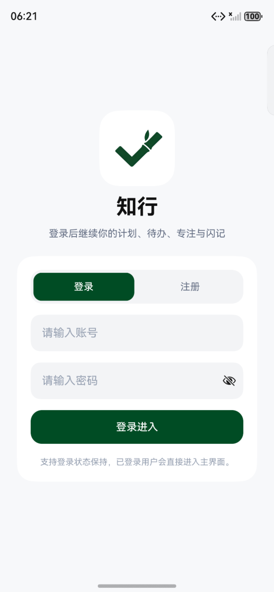
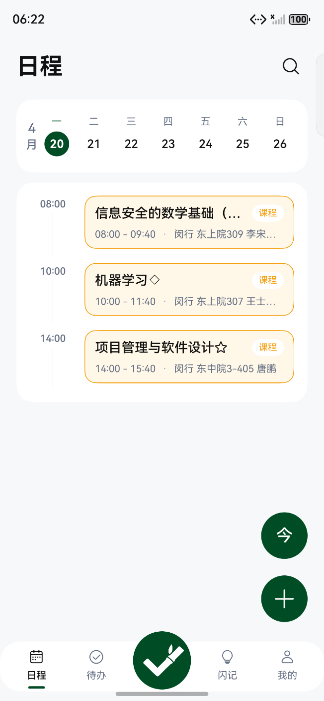
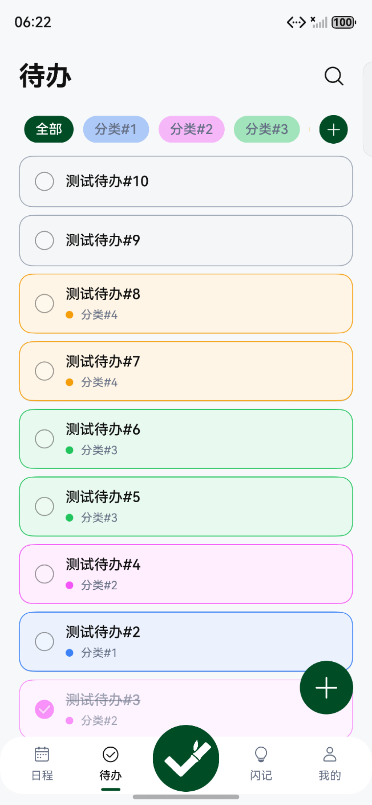
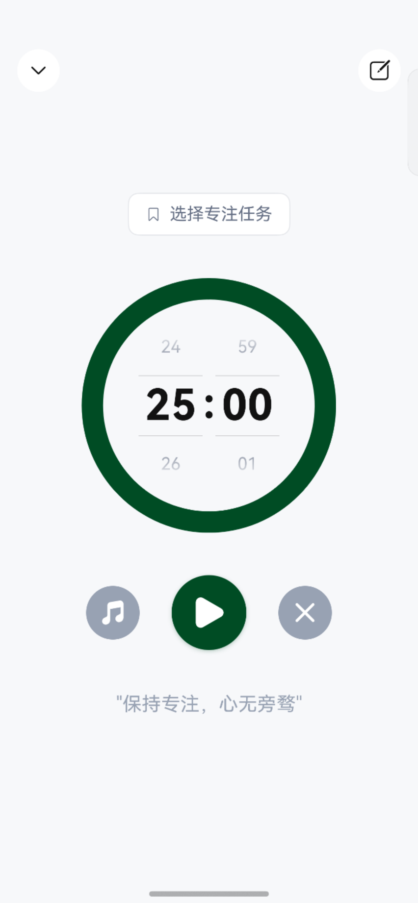
</div>

<div style="text-align: center; margin-top: 8px;">
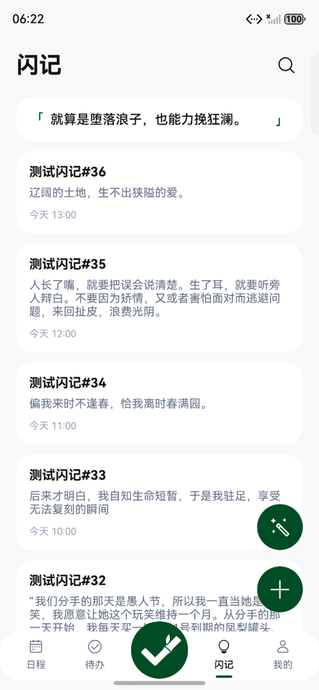
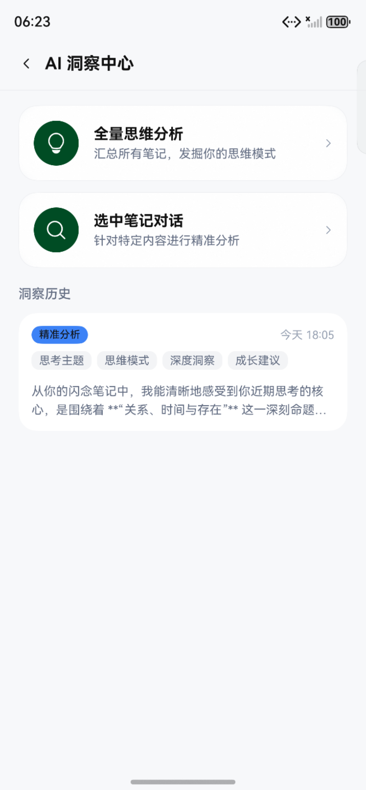
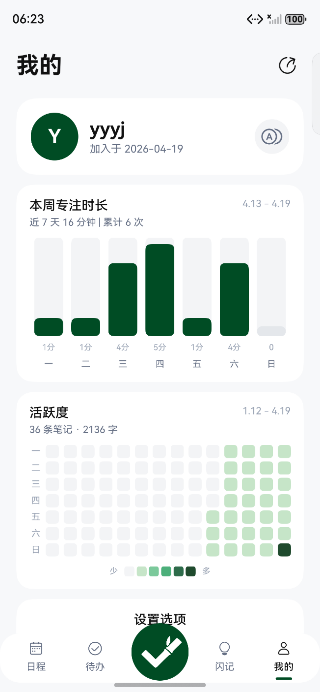
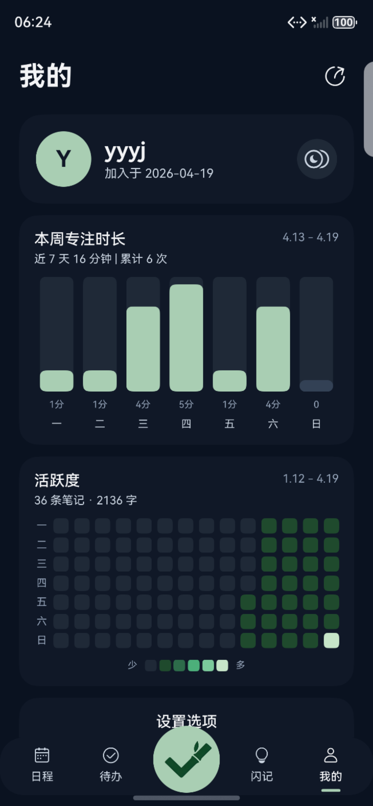
</div>

应用覆盖从登录到主工作台的完整路径，五大主页面与专注沉浸页共享统一主题和交互规范，并实现应用深浅色适配，AI 洞察页展示智能能力的集成效果。

## 项目展望
由于课程项目时间限制，本产品只实现了核心 MVP 功能，后续可在以下方向进行迭代完善：

- **Bug 修复**：导出数据库时不包含专注时长和AI 洞察数据。
- **功能完善**：如日程的周期性任务、待办的优先级与截止日期设置、闪记的多媒体与 Markdown 渲染支持、AI 洞察的 API 自主配置、用户头像自定义、账户名称及密码修改等。
- **性能优化**：持续优化应用性能，增加懒加载机制，提升启动速度与响应效率，改善用户体验。
- **日程提醒**：集成后台系统通知能力，无需假借系统日历应用，实现本地化的日程提醒功能，提升用户的时间管理效率。
- **桌面组件**：利用 HarmonyOS 的桌面组件能力，提供日程、待办、闪记及统计等桌面小组件，让用户能够在桌面快速查看和管理重要信息，提升应用的触达率和使用频次。
- **多设备支持**：基于 HarmonyOS 的分布式能力，支持跨设备数据同步与界面适配，如在平板、智能屏等大屏设备上提供增强的日程视图与专注模式。
- **智能能力扩展**：在 AI 洞察基础上，进一步挖掘用户数据的智能价值，如提供基于日程与待办的智能推荐、基于闪记的创意分析等，打造更具个性化和前瞻性的生产力工具。
- **用户体验优化**：持续收集用户反馈，优化界面设计与交互逻辑，如增加更多的主题选项、提供更灵活的任务管理方式、增强专注模式的沉浸感等，提升整体用户满意度。

## 贡献
- [wsm25](https://github.com/wsm25)：组织开展需求分析会议与应用开发会议，负责应用基础功能模块开发与通用组件开发，包括数据模型拆解与数据库搭建等，实现日程通知功能与导入导出模块，负责项目管理与分支合并
- [youyeyejie](https://github.com/youyeyejie)：开展产品需求分析与总体设计，进行竞品调研与应用原型设计，负责应用基础功能模块开发与通用组件开发，包括待办页面开发等，负责应用整体 UI 设计与调整，负责项目管理与分支合并
- [yueqi-g](https://github.com/yueqi-g)：负责日程页面与待办页面的开发，实现页面组件与功能逻辑，实现多种交互方式，PPT
- [AdaChangL](https://github.com/AdaChangL)：负责专注页面的开发，实现页面组件与交互逻辑，打通待办与专注页面的联动，实现应用系统消息通知功能
- [qianheng184](https://github.com/qianheng184)：负责闪记页面开发，实现页面组件与交互逻辑，实现 AI 洞察功能与闪记热力图功能
- [axgo-ja](https://github.com/axgo-ja)：负责用户页面和登录注册页面开发，实现页面组件与交互逻辑，完善用户登录注册逻辑，PPT
